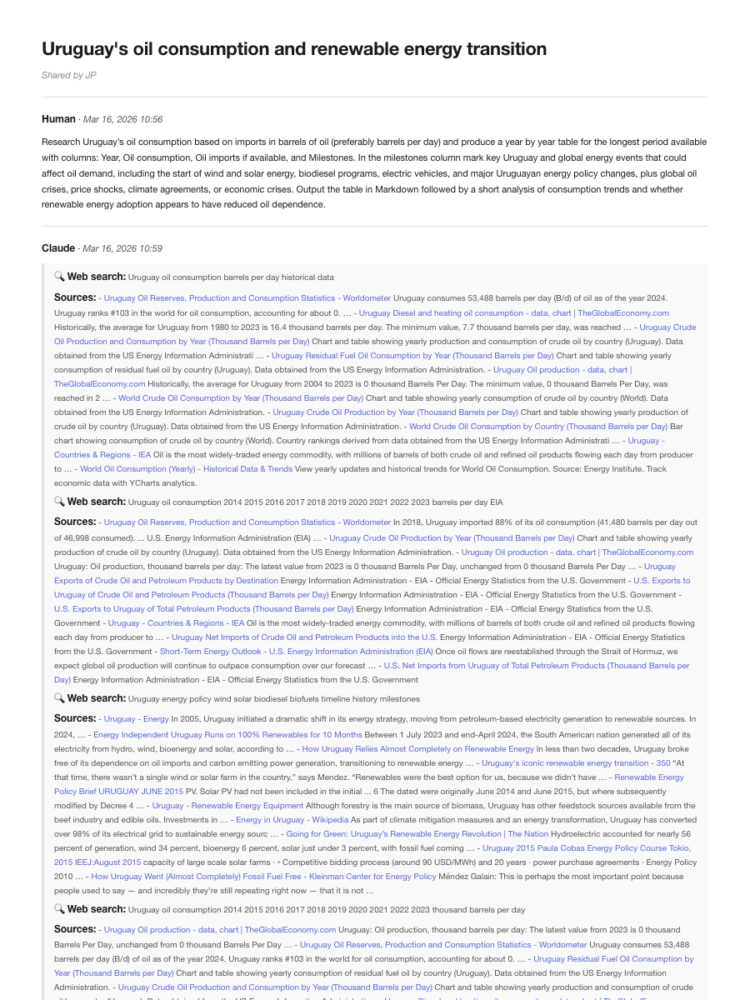
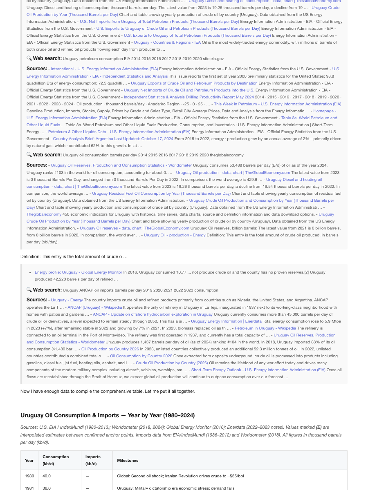
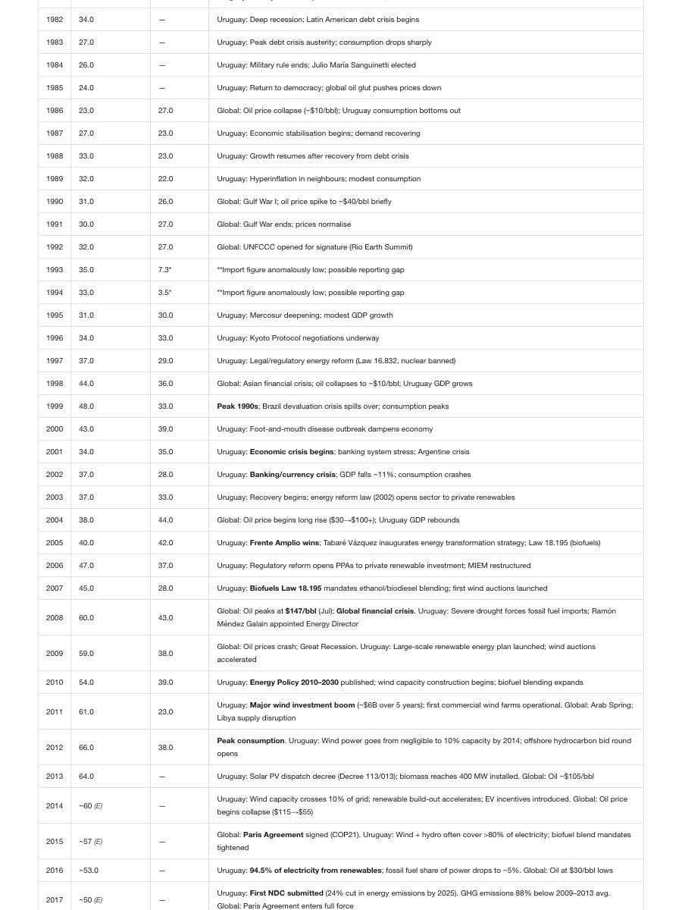

# claude-chat-export

Convert Claude.ai conversations to Markdown and PDF — including artifacts (interactive widgets, charts, code), web search results, and full message history.

## Example output

<p align="center">
  
  
  
</p>

## Features

- **URL mode**: Fetch directly from a Claude share URL — gets full conversation with artifact source code
- **HTML mode**: Parse a saved Claude HTML page — extracts text content
- **PDF export**: Clean, minimalistic styled PDF via `--pdf`
- **Artifacts**: Interactive widgets, charts, and code are included as code blocks
- **Web search sources**: Compact linked excerpts by default, or full content with `--include-sources`

## Installation

```bash
# Clone and install
git clone https://github.com/jpchavat/claude-chat-export.git
cd claude-chat-export
uv sync

# Install browser for URL mode and PDF generation (one-time)
uv run playwright install chromium
```

## Usage

```bash
# From a share URL (recommended — includes artifacts)
uv run claude-chat-export https://claude.ai/share/<uuid>

# From a saved HTML file
uv run claude-chat-export conversation.html

# Generate PDF alongside Markdown
uv run claude-chat-export https://claude.ai/share/<uuid> --pdf

# Include full web search source content
uv run claude-chat-export https://claude.ai/share/<uuid> --include-sources

# Custom output path
uv run claude-chat-export https://claude.ai/share/<uuid> -o notes.md
```

## Options

| Flag | Description |
|------|-------------|
| `-o, --output` | Output file path (default: `<uuid>.md` or `<file>.md`) |
| `--pdf` | Also generate a styled PDF alongside the Markdown output |
| `--include-sources` | Include full web search source content instead of compact excerpts |
| `--no-artifacts` | Skip artifact code extraction |

## How it works

- **URL mode**: Uses Playwright to load the share page and intercepts the `chat_snapshots` API response, which contains the full conversation data including artifact widget code.
- **HTML mode**: Parses the saved HTML with BeautifulSoup to extract rendered messages. Artifact source code is not available in static HTML exports (the code is delivered via postMessage at runtime).
- **PDF rendering**: Converts Markdown to styled HTML with a clean, minimalistic CSS theme, then uses Chromium's built-in PDF printing via Playwright.

## License

MIT
